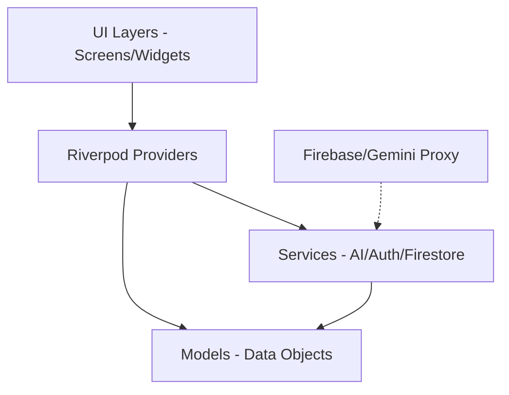

# Sistem Desenleri (System Patterns)

Bu bölüm, uygulamanın mimari kararlarını, tasarım desenlerini ve bileşen ilişkilerini tanımlar.

## Sistem Mimarisi
Uygulama, Riverpod tabanlı modern bir katmanlı mimari kullanır.

## Tasarım Desenleri
- **Notifier Pattern:** `ThemeProvider` ve `AuthNotifier` için `Notifier` (Riverpod) kullanılarak durum yönetimi (state management) sağlanır.
- **Repository Pattern (Basitleştirilmiş):** `AiService` tüm yapay zeka işlemlerini kapsüller ve UI'dan izole eder.
- **Composition over Inheritance:** `BrandedTextField` ve `GradientButton` gibi yeniden kullanılabilir küçük bileşenler (widgets) tercih edilmiştir.
- **Async Pattern:** Firebase ve AI servisleri için `Future` ve `Stream` (Firestore) yapıları kullanılır.

## Bileşen İlişkileri
- **`main.dart`:** Uygulamanın giriş noktasıdır, `themeModeProvider`'ı dinleyerek tüm uygulamanın temasını yönetir.
- **`ResultScreen`:** `AiService.sendFollowUp` metodunu kullanarak interaktif sohbet özelliğini yönetir.
- **`ComparisonModel`:** Firestore'dan gelen ham verileri Dart nesnelerine (ve tersi) çevirir.

## Kodlama Kuralları (Standardlar)
- **İsimlendirme:** Dosya isimleri `snake_case`, sınıf isimleri `PascalCase`, değişken isimleri `camelCase`.
- **UI:** Tüm UI bileşenlerinde `AppTheme` içindeki sabit renkler ve gradyanlar kullanılmalıdır.
- **Firebase:** Tüm veritabanı işlemleri `try-catch` blokları içinde ele alınmalı ve hatalar kullanıcıya bildirilmelidir.
- **YZ İstekleri:** `##` ile başlayan başlık formatı (markdown) korunmalıdır.
